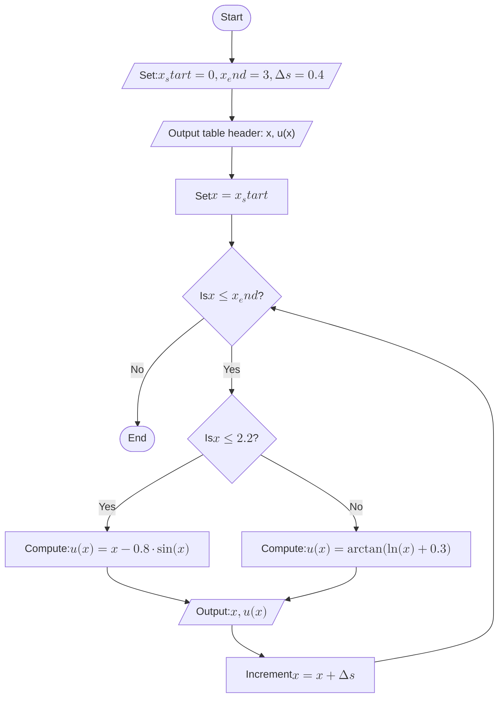
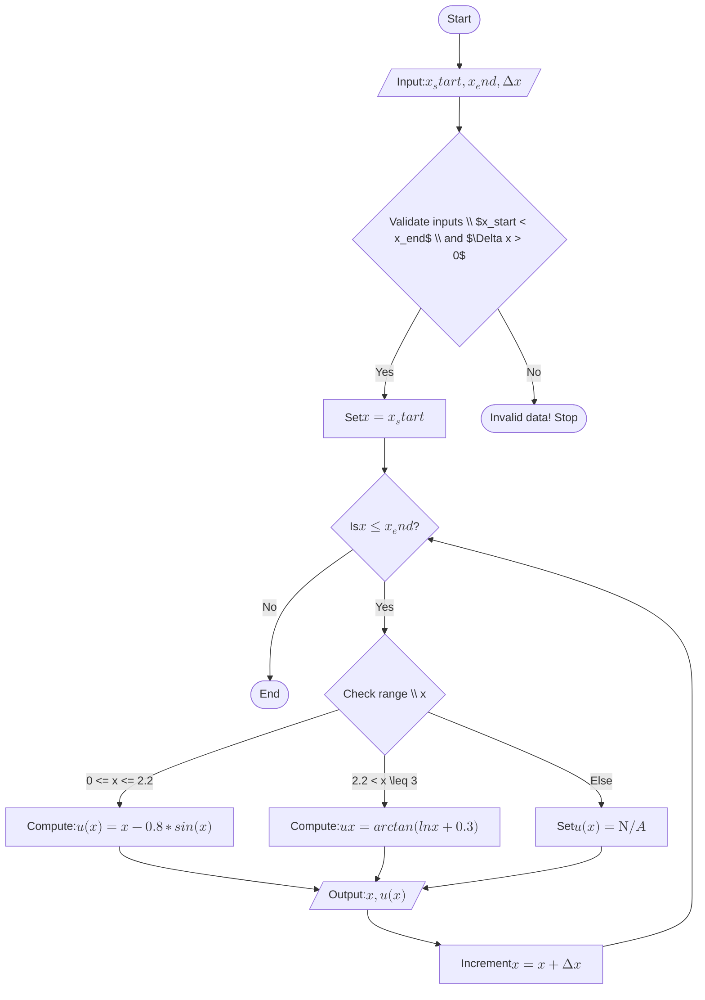
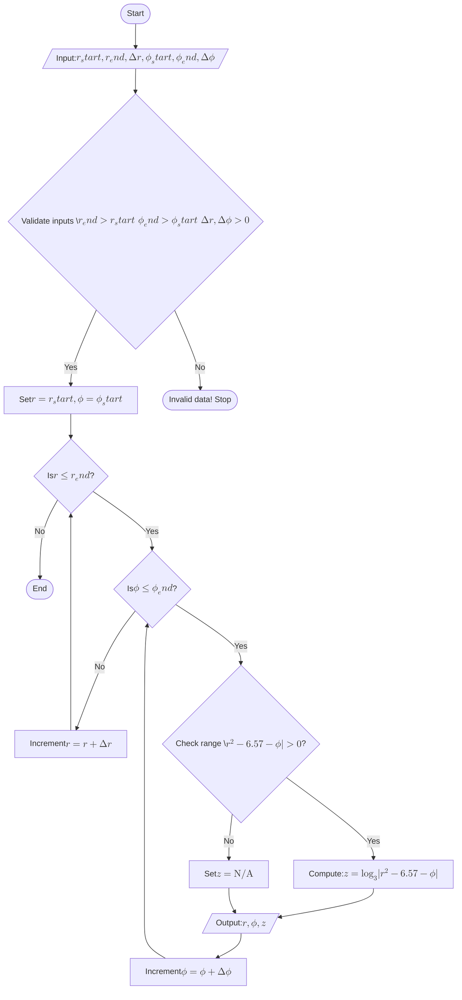

# 4.1 | V - 11

```mermaid
graph TD
    A([Start]) --> B[/"Set: $$x_start = 0, x_end = 3, \Delta s = 0.4$$"/]
    B --> C[/"Output table header: x, u(x)"/]
    C --> D[Set $$x = x_start$$]
    D --> E{Is $$x \leq x_end$$?}
    E -- No --> F([End])
    E -- Yes --> G{Is $$x \leq 2.2$$?}
    G -- Yes --> H["Compute: $$u(x) = x - 0.8 \cdot \sin(x)$$"]
    G -- No --> I["Compute: $$u(x) = \arctan(\ln(x) + 0.3)$$"]
    H --> J[/"Output: $$x, u(x)$$"/]
    I --> J
    J --> K[Increment $$x = x + \Delta s$$]
    K --> E

```
# 4.2 | V - 11

```mermaid
graph TD
    A([Start]) --> B[/Input: $$x_start, x_end, \Delta x$$/]
    B --> C{Validate inputs \\ $x_start < x_end$ \\ and $\Delta x > 0$}
    C -- Yes --> D[Set $$x = x_start$$]
    C -- No --> Z([Invalid data! Stop])
    D --> E{Is $$x \leq x_end$$?}
    E -- No --> F([End])
    E -- Yes --> G{Check range \\ x}
    G -- 0 <= x <= 2.2 --> H["Compute: $$u(x) = x - 0.8 * sin(x)$$"]
    G -- 2.2 < x \leq 3 --> I["Compute: $$ux = arctan(lnx + 0.3)$$"]
    G -- Else --> J["Set $$u(x) = \text N/A$$"]
    H --> K[/"Output: $$x, u(x)$$"/]
    I --> K
    J --> K
    K --> L[Increment $$x = x + \Delta x$$]
    L --> E

```
# 4.3 | V - 11

```mermaid
graph TD
    A([Start]) --> B[/"Input: $$r_start, r_end, \Delta r, \phi_start, \phi_end, \Delta \phi$$"/]
    B --> C{"Validate inputs \\ $$r_end >  r_start \\ \phi_end > \phi_start \\ \Delta r, \Delta \phi > 0$$"}
    C -- Yes --> D["Set $$r = r_start, \phi = \phi_start$$"]
    C -- No --> Z([Invalid data! Stop])
    D --> E{Is $$r \leq r_end$$?}
    E -- No --> F([End])
    E -- Yes --> G{Is $$\phi \leq \phi_end$$?}
    G -- No --> L[Increment $$r = r + \Delta r$$] --> E
    G -- Yes --> H{"Check range \\ $$r^2 - 6.57 - \phi| > 0$$?"}
    H -- Yes --> I["Compute: $$z = \log_3 |r^2 - 6.57 - \phi|$$"]
    H -- No --> J["Set $$z = \text{N/A}$$"]
    I --> K[/"Output: $$r, \phi, z$$"/]
    J --> K
    K --> M[Increment $$\phi = \phi + \Delta \phi$$]
    M --> G
```
